# 🤖 Autonomous Software Engineer


An autonomous coding agent that **writes, tests, runs, and debugs** its own code. 
Powered by **LangGraph** and **GPT-4o**, it mimics a real-world engineering team (Developer, QA, Executor) to solve complex algorithmic problems without human intervention.

## 🧠 The Architecture

This project simulates a closed-loop software development lifecycle using a State Graph:

```mermaid
graph TD
    Start([🚀 Start]) --> Dev[👨‍💻 Developer Agent]
    Dev --> QA[🕵️‍♂️ QA Agent]
    QA --> Exec[🐳 Docker Executor]
    
    Exec -- "❌ Test Failed" --> Dev
    Exec -- "✅ All Passed" --> Success([🏆 Mission Accomplished])

    subgraph "Self-Healing Loop"
    Dev
    QA
    Exec
    end
```



## 📂 Project Structure
```plaintext
autonomous_engineer/
├── main.py                 # 🚀 Entry Point
├── workspace/              # 📂 Live Output (Code + Logs)
└── src/
    ├── core/               # 🧱 Configuration & State
    │   ├── config.py       # LLM Factory (OpenAI)
    │   ├── state.py        # Pydantic Schemas
    │   └── logger.py       # Color Logging System
    ├── agents/             # 🧠 The Brains
    │   ├── developer.py    # Logic for writing/fixing code
    │   └── tester.py       # Logic for writing tests
    ├── runtime/            # 🛠️ The Infrastructure
    │   ├── sandbox.py      # Docker Client Interface
    │   └── executor.py     # Graph Node for Execution
    └── workflow.py         # 🕸️ LangGraph Wiring
```

## 🚀 Getting Started

### Prerequisites
* Python 3.9+
* **Docker Desktop** (Must be running)
* OpenAI API Key

### Installation
1. **Clone the repository**
```bash
git clone https://github.com/AryanParekh/Autonomous-Software-Engineer.git
cd autonomous-software-engineer
```
2. **Create a Virtual Environment**
```bash
python -m venv venv
venv\Scripts\activate
```
3. **Install Dependencies**
```bash
pip install -r requirements.txt
```
4. **Set up Environment Variables** Create a .env file in the root directory:
```bash
OPENAI_API_KEY="xxxx"
```
6. **Initialize Docker Image** (Optional but recommended)
```bash
docker pull python:3.9-slim
```

### Usage
Run the main script to start the agent:
```bash
python main.py
```
The agent will attempt to solve the [Trapping Rain Water](https://leetcode.com/problems/trapping-rain-water/description/) problem (LeetCode Hard). You can watch the progress in your terminal or by opening ```workspace/mission_report.md```.

## 🛡️ Security Note
This tool executes AI-generated code. While it uses **Docker** for isolation, always review the generated code in ```workspace/``` before using it in production environments.

## 📄 License
MIT License. Free to use and modify.
